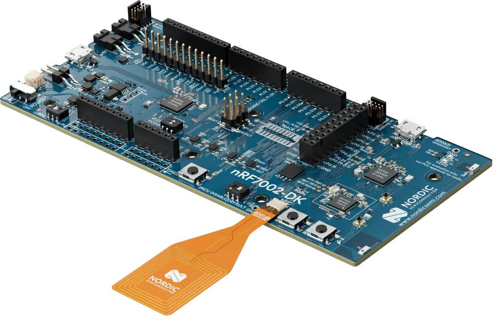
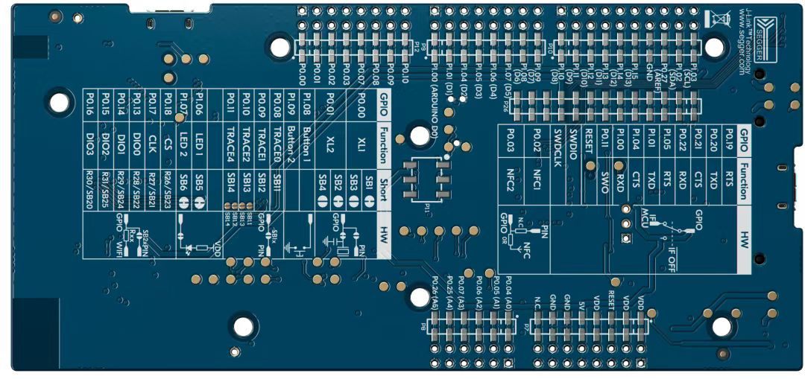
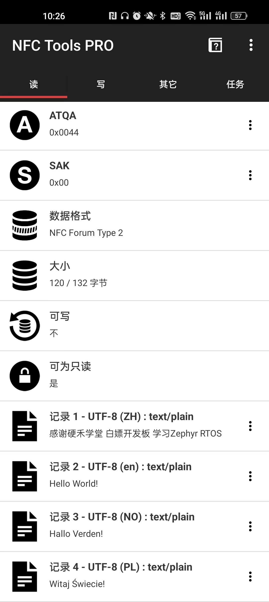

# Funpack第二季第六期：nRF7002-DK活动

**主要内容框架**

**1、板卡介绍**

**2、任务目标**

**3、开发环境**

**4、应用开发**

**5、心得体会**

活动主页 [Funpack第二季第六期：NRF7002-DK - 电子森林](https://www.eetree.cn/project/detail/1768)

参加**硬禾学堂**、**得捷电子**和**Nordic Semiconductor** 举办的这一期活动，了解Zephyr操作系统和蓝牙、NFC的使用。

板卡实物图：





## 1 板卡介绍

简单介绍：nRF7002-DK是用于nRF7002 Wi-Fi 6协同IC的开发套件，该开发套件采用nRF5340多协议片上系统 (SoC) 作为nRF7002的主处理器，在单一的电路板上包含了开发工作所需的一切，可让开发人员轻松开启基于nRF7002 的物联网项目。该 DK 包括 Arduino 连接器、两个可编程按钮、一个 Wi-Fi 双频段天线和一个低功耗蓝牙天线，以及电流测量引脚。

特性：

Arduino连接器

两个可编程的按钮

搭载nRF7002 Wi-Fi协同IC

作为主处理器的nRF5340 SoC

电流测量引脚

2.4GHz、2.4/5 GHz和NFC天线

高性能的128MHz Arm Cortex-M33应用内核 

超低功率的64MHz Arm Cortex-M33网络核心

## 2 任务目标

**任务三：** 使用板卡的NFC功能，模拟出一个自定义功能的卡片，使用手机靠近并能读取卡片信息

详细描述：使用一个LED灯作为指示灯，当手机NFC靠近板卡并且读取板卡发送的信息。此时LED灯闪烁。手机使用NFC Tool 软件读取板卡发送的信息可以查看详细信息。

保留任务一

## 3 开发环境

win10专业版，开发工具:[Visual Studio Code](https://code.visualstudio.com/)

环境搭建：直接参考教程做就行 ，一次不行就在安装一次 反复四次就行。心平气和即可！

参考教程：

0[Welcome to the nRF Connect SDK! — nRF Connect SDK 2.4.99 documentation (nordicsemi.com)](https://developer.nordicsemi.com/nRF_Connect_SDK/doc/latest/nrf/index.html) 官网教程安装也是可以的

3.1[bluetoothlover_doc/source/00_supperthomas/15_zephyr/01_NCS_quick_start/index.md at master · supperthomas/bluetoothlover_doc (github.com)](https://github.com/supperthomas/bluetoothlover_doc/blob/master/source/00_supperthomas/15_zephyr/01_NCS_quick_start/index.md) 直接参考这个就行，如果不行就看备注。

备注：

    参考1的做法安装之后可能存在下载的sdk软件包为空的问题，也就是V2.x.0目录下只有一个west的目录。

    还有可能存在的一个问题就是在新建工程之后创建编译环境的时候找不到开发板的BSP的选择。此时就是需要重新安装SDK包。

    这个时候就可以参考[开发你的第一个nRF Connect SDK(NCS)/Zephyr应用程序 - iini - 博客园 (cnblogs.com)](https://www.cnblogs.com/iini/p/14174427.html) 这个博客里面的一部分可以参考 就是使用他的百度网盘提供的软件包离线安装就行。搭配视频安装教程来使用上个链接的方法：【nrf7002开发环境搭建】 https://www.bilibili.com/video/BV1Lk4y1F7bG/?share_source=copy_web&vd_source=92dd524240ffe301bd49347e8e28a7ad

其余的搭建环境的方法有很多，请自行搜索解决。谢谢！

## 4 应用开发

任务三较为简单，此处我也没有新的想法，只是循规蹈矩来做这个任务。任务分成两个部分LED灯、NFC使用两个部分。

### 4.1 LED 点灯

参考资料：[NFC: Text record — nRF Connect SDK 2.4.99 documentation (nordicsemi.com)](https://developer.nordicsemi.com/nRF_Connect_SDK/doc/latest/nrf/samples/nfc/record_text/README.html) 主要是这个资料

[基于nRF7002-DK的NFC功能切换系统(nRF Connect SDK+NFC)_KafCoppelia的博客-CSDN博客](https://blog.csdn.net/weixin_46422143/article/details/132958016) 

```c
// main.c
// 直接调用这个函数进行初始化LED和按键 这是个库
#define NFC_FIELD_LED        DK_LED1  // DK_LED1  0 
if (dk_leds_init() < 0) {
    printk("Cannot init LEDs!\n");
    goto fail;
}
// 定义为回调函数，传入nfc_t2t_setup函数，当手机NFC接近板卡此时就是LED1灯点亮
// 参数：context(上下文)，event(事件类型)，data(数据指针)，data_length(数据长度)
static void nfc_callback(void *context,
             nfc_t2t_event_t event,
             const uint8_t *data,
             size_t data_length)
{
    ARG_UNUSED(context);
    ARG_UNUSED(data);
    ARG_UNUSED(data_length);

    switch (event) {
    // 若event的值等于NFC_T2T_EVENT_FIELD_ON，表示检测到NFC场景开启
    case NFC_T2T_EVENT_FIELD_ON:
        dk_set_led_on(NFC_FIELD_LED);
        break;
    // 若event的值等于NFC_T2T_EVENT_FIELD_OFF，表示检测到NFC场景关闭
    case NFC_T2T_EVENT_FIELD_OFF:
        dk_set_led_off(NFC_FIELD_LED);
        break;
    default:
        break;
    }
}

// dk_buttons_leds.c
// 初始化一组LED灯的GPIO配置并设置它们的状态
int dk_leds_init(void)
{
    int err;

    for (size_t i = 0; i < ARRAY_SIZE(leds); i++) {
        // 调用了一个函数gpio_pin_configure_dt，它用于配置特定的GPIO引脚。
        // &leds[i]表示取得leds数组中第i个元素的地址,此时也就是使用LED1
        // GPIO_OUTPUT表示将该引脚配置为输出模式。将函数返回的错误码赋值给err变量
        err = gpio_pin_configure_dt(&leds[i], GPIO_OUTPUT);
        if (err) {
            LOG_ERR("Cannot configure LED gpio");
            return err;
        }
    }
    // 如果配置成功，则调用dk_set_leds_state函数，设置所有LED的状态。
    // DK_NO_LEDS_MSK 表示要设置为关闭状态的LED掩码，
    // DK_ALL_LEDS_MSK 表示要设置为打开状态的LED掩码。
    return dk_set_leds_state(DK_NO_LEDS_MSK, DK_ALL_LEDS_MSK);
}
```

使用 `dk_leds_init`初始化LED灯，使用`nfc_callback`控制LED灯。以上代码都有在例程中找到。

### 4.2 NFC部分

使用NRF的nfc库来，使用`NFC_NDEF_MSG_DEF`创建NDEF文本记录描述符，随后使用`nfc_ndef_msg_record_add`将记录加入NDEF消息中，之后使用 `nfc_ndef_msg_encode` 编码，并存入 `buffer` 内，长度为 `len` 。这样就把想要发送的数据编码成功。重复`nfc_ndef_msg_record_add`可以实现多条信息的添加。

```c
// 创建了一个名为 nfc_text_msg 的 NDEF 消息对象，
// 并根据 MAX_REC_COUNT 作为参数指定了该消息对象可以包含的记录数-MAX_REC_COUNT
NFC_NDEF_MSG_DEF(nfc_text_msg, MAX_REC_COUNT);


/** nfc_ndef_msg_record_add 函数，用于向NFC NDEF消息中添加一条记录。它接受两个参数：nfc_msg 和 desc
* 参数：nfc_msg 是指向NFC NDEF消息的指针。
*       desc 是指向NFC NDEF文本记录描述符的指针。
* 返回值：返回一个小于0的值，表示添加记录失败
*/
// &NFC_NDEF_MSG(nfc_text_msg) 表示获取NFC NDEF文本消息的指针。
// &NFC_NDEF_TEXT_RECORD_DESC(nfc_zh_text_rec) 表示获取NFC NDEF中文文本记录描述符的指针。
err = nfc_ndef_msg_record_add(&NFC_NDEF_MSG(nfc_text_msg),
                  &NFC_NDEF_TEXT_RECORD_DESC(nfc_zh_text_rec));
if (err < 0) {
    printk("Cannot add first record!\n");
    return err;
}

/**函数nfc_ndef_msg_encode来将NDEF消息编码到指定的缓冲区中。
*  参数: &NFC_NDEF_MSG(nfc_text_msg)表示获取一个NFC文本消息的NDEF消息结构的指针，
*       buffer是指向目标缓冲区的指针，
*       len是缓冲区的长度。
*  返回值: 返回值被赋给变量err,小于零表示编码失败
*/
err = nfc_ndef_msg_encode(&NFC_NDEF_MSG(nfc_text_msg),
                      buffer,
                      len);
if (err < 0) {
    printk("Cannot encode message!\n");
}
```

编码待发送的信息

```c
/**en_code  是一个包含语言代码的字符数组指针，用于指定文本记录描述符中的语言代码。
 * 语言代码用于指示记录中的文本使用的是哪种语言。
 * 举例如下：
 * "en"：英语
 * "zh"：中文
 * "ja"：日语
 * "fr"：法语
 * "es"：西班牙语
 * "de"：德语
 * "ko"：韩语
 * "it"：意大利语
 * "pl":波兰语
 * "no":是挪威语的 ISO 639-1 语言代码
*/ 
// 多个待发送的信息的内容长度是不一样的，但是使用的是同一块buffer存储NDEF消息的。
#define NDEF_MSG_BUF_SIZE 256
// 使用的是utf-8的编码方式,存在隐患如果是ACSII编码查看中文信息则是乱码。
// 解决方法可以使用utf-16编码方式。
// 中文的utf-8的编码如下
// "感谢硬禾学堂" 的 UTF-8 编码:
// 0xE6, 0x84, 0x9F, 0xE8, 0xB0, 0xA2, 0xE7, 0xA1, 0xAC, 0xE7, 0xA6, 0xBE, 0xE5, 0xAD, 0xA6, 0xE5, 0xA0, 0x82
// "白嫖开发板" 的 UTF-8 编码:
// 0xE7, 0x99, 0xBD, 0xE5, 0xAB, 0x96, 0xE5, 0xBC, 0x80, 0xE5, 0x8F, 0x91, 0xE6, 0x9D, 0xBF
// "学习Zephyr RTOS" 的 UTF-8 编码:
// 0xE5, 0xAD, 0xA6, 0xE4, 0xB9, 0xA0, 0x5A, 0x65, 0x70, 0x68, 0x79, 0x72, 0x20, 0x52, 0x54, 0x4F, 0x53
static const uint8_t zh_payload[] = {
    0xE6, 0x84, 0x9F, 0xE8, 0xB0, 0xA2, 0xE7, 0xA1, 0xAC, 0xE7, 0xA6, 0xBE, 0xE5, 0xAD, 0xA6, 0xE5, 0xA0, 0x82,
    ' ',
    0xE7, 0x99, 0xBD, 0xE5, 0xAB, 0x96, 0xE5, 0xBC, 0x80, 0xE5, 0x8F, 0x91, 0xE6, 0x9D, 0xBF,
    ' ',
    // 这句话可以替换为0xE5, 0xAD, 0xA6, 0xE4, 0xBD, 0xA0, 0x5A, 0x65, 0x70, 0x68, 0x79, 0x72, 0x20, 0x52, 0x54, 0x4F, 0x53
    // 'z', 'e', 'p', 'h', 'y', 'e', 'r', 'R', 'T', 'O', 'S'
    0xE5, 0xAD, 0xA6, 0xE4, 0xB9, 0xA0, 0x5A, 0x65, 0x70, 0x68, 0x79, 0x72, 0x20, 0x52, 0x54, 0x4F, 0x53
};

static const uint8_t zh_code[] = {'Z', 'H'}; 
// 调用方法
NFC_NDEF_TEXT_RECORD_DESC_DEF(nfc_text_rec,
                              UTF_8,
                              zh_code,
                              sizeof(zh_code),
                              zh_payload,
                              sizeof(zh_payload));
```

在主函数中直接调用即可

```c
int mian(void)
{
    uint32_t len = sizeof(ndef_msg_buf);

    printk("Starting NFC Text Record example\n");

    /* Configure LED-pins as outputs */
    // 初始化配置LED的GPIO引脚
    if (dk_leds_init() < 0) {
        printk("Cannot init LEDs!\n");
        goto fail;
    }

    /* Set up NFC */
    // 判断是否设置NFC T2T（Near Field Communication，近场通信）库。如果设置失败（返回值小于0），
    // 则打印错误信息"Cannot setup NFC T2T library!"并跳转到标签为"fail"的位置继续执行
    /** nfc_t2t_setup 是一个函数，用于设置NFC T2T库。它接受两个参数：nfc_callback 和 user_data
     * 参数：
     *  nfc_callback 是一个指向NFC回调函数的指针，用于处理NFC事件。
     *  user_data 是用户自定义的数据，可以传递给回调函数。
     * 返回值：如果 nfc_t2t_setup 函数返回一个小于0的值，表示设置NFC T2T库失败
     * */
    if (nfc_t2t_setup(nfc_callback, NULL) < 0) {
        printk("Cannot setup NFC T2T library!\n");
        goto fail;
    }


    /* Encode welcome message */
    // 编码待发送的信息也就是那几条NFC的内容
    if (welcome_msg_encode(ndef_msg_buf, &len) < 0) {
        printk("Cannot encode message!\n");
        goto fail;
    }

    /* Set created message as the NFC payload */
    // 判断是否设置NFC T2T（Near Field Communication，近场通信）的有效负载。如果设置失败（返回值小于0），
    // 则打印错误信息"Cannot set payload!"并跳转到标签为"fail"的位置继续执行。
    // nfc_t2t_payload_set 是一个函数，用于设置NFC T2T的有效负载。它接受两个参数：ndef_msg_buf 和 len
    //     参数 ndef_msg_buf 是指向要设置有效负载的数据缓冲区的指针
    //         len 是有效负载数据的长度
    // 如果 nfc_t2t_payload_set 函数返回一个小于0的值，表示设置有效负载失败
    if (nfc_t2t_payload_set(ndef_msg_buf, len) < 0) {
        printk("Cannot set payload!\n");
        goto fail;
    }

    /* Start sensing NFC field */
    // 判断是否启动NFC T2T（Near Field Communication，近场通信）仿真。如果启动失败（返回值小于0），
    // 则打印错误信息"Cannot start emulation!"并跳转到标签为"fail"的位置继续执行
    /**nfc_t2t_emulation_start 是一个函数，用于启动NFC T2T仿真。它不接受任何参数
     * 返回值：如果 nfc_t2t_emulation_start 函数返回一个小于0的值，表示启动仿真失败。
    */
    if (nfc_t2t_emulation_start() < 0) {
        printk("Cannot start emulation!\n");
        goto fail;
    }
    printk("NFC configuration done\n");

    return 0;    
}
```

当功能为记录中文文本信息时，在手机NFC触碰后，LED2将亮起，手机移开后，NFC连接移除，LED2灭，效果图如下：



## 5 新的体会

    本次使用NRF7002-DK开发板使用Zypher操作系统进行开发，开发环境有点难搭建。其他的都还好，这次活动的任务比较有意思，针对zephyr比较感兴趣，学习设备树和Kconfig的配置使用。

    总体上这次活动还是学习嵌入式操作系统的相关知识。
